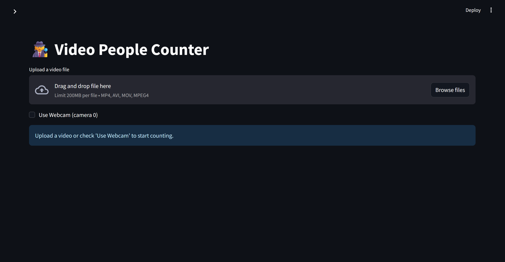
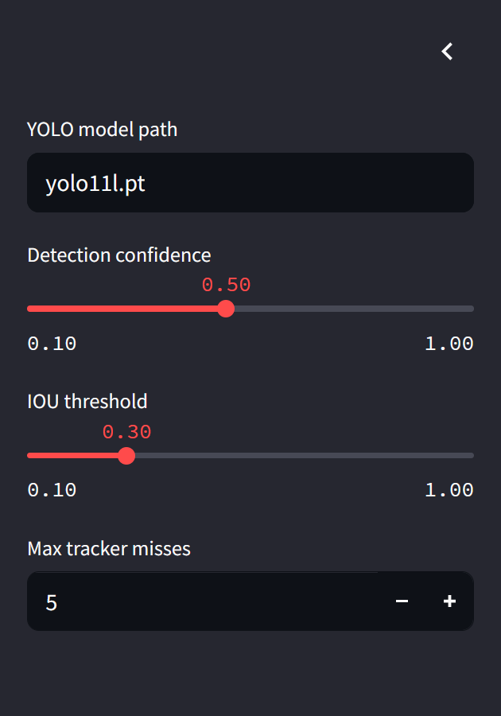
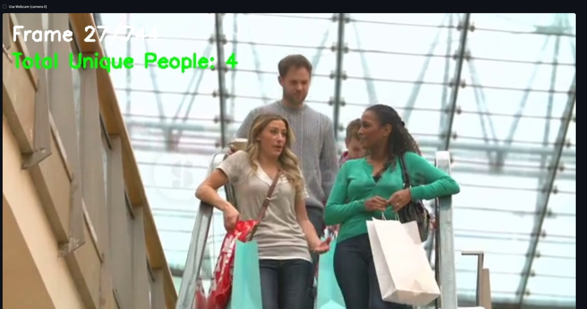

# 🚦 **Automated Crowd Counter** 🚦

_A smart solution to count people in busy scenes in real time, using YOLO for detection and CSRT+IoU for robust tracking._

[](https://www.python.org/)  
[](LICENSE)  
[](https://streamlit.io)  
[](https://github.com/ultralytics/ultralytics)

---

## 📚 Table of Contents

- 📌 [Overview](#-overview)
- 🧠 [Features](#-features)
- 🧭 [Architecture & Design](#-architecture--design)
- 🚀 [Getting Started](#-getting-started)
- 🛠️ [Installation & Setup](#-installation--setup)
- 🎯 [Usage](#-usage)
- 🎥 [Demo](#-demo)
- 💡 [How It Works](#-how-it-works)
- 📁 [Project Structure](#-project-structure)

---

## 📌 Overview

Welcome to the 🧍‍♂️🧍‍♀️ People Detection & Tracking System!  
This project is a robust, real-time object detection and tracking solution built using the Ultralytics YOLOv11 model and OpenCV’s powerful CSRT tracker. The system counts people across video frames, tracks their movement, and visualizes their trajectories.

This was created as a research-grade tool with performance, clarity, and flexibility in mind. It can be extended for smart surveillance systems, retail footfall analysis, or any application involving human activity tracking.

> 🛠️ A huge part of the development effort went into managing conflicting dependencies (OpenCV contrib, Ultralytics, Torch, etc.) — don’t worry, we’ve got a clean and simple setup process covered below. 🎯

---

## 🧠 Features

✨ Real-Time Object Detection with YOLOv11-Large  
📦 Lightweight & Fast Tracking via CSRT (Disambiguates overlapping people)  
📊 People Counter with Dynamic Updates  
🎨 Visual Bounding Boxes & ID Tracking  
🧩 Modular Codebase for Easy Customization  
📽️ Works with webcam feeds, video files, or RTSP streams  
📂 Well-structured project with clean logging & Streamlit UI support  
📌 Compatible with OpenCV Contrib and modern Torch versions  

---

## 🧭 Architecture & Design

The system is built around modular, clean Python files designed for readability and scalability. Here’s a bird’s-eye view:


### 🧰 Modules

- **app.py**  
  🎬 Main entry point. Loads video stream, runs detection, tracking, and counting loop.  
- **detector.py**  
  🔍 Wrapper around Ultralytics YOLOv11 to detect people in frames.  
- **tracker.py**  
  🎯 Handles object tracking using OpenCV’s CSRT tracker, assigning unique IDs.  
- **people_counter/**  
  📦 Sub-package that organizes business logic:  
  - **counter.py** → Counts people across frames  
  - **utils.py** → Helper functions (drawing boxes, logging, etc.)  
  - **tracker_config.yaml** → Tuning parameters  
- **requirements.txt**  
  📄 All pinned dependencies required for successful setup.

---

## 🚀 Getting Started

### Purpose
This project delivers a real-time people-counting system for video streams, automating crowd size estimation and traffic flow analysis. It detects, tracks, and counts unique individuals in each frame, supporting inputs like webcam feeds, video files, or RTSP streams. Results include live counts, bounding boxes, and time-vs-count analytics.

### Technologies
- **Python 3.10+**: Core programming language  
- **Ultralytics YOLOv11**: For object detection  
- **OpenCV-contrib (CSRT)**: For multi-object tracking  
- **Streamlit**: For the web-based user interface  
- **NumPy, SciPy, Matplotlib, Pandas**: For data handling and visualization  

### Prerequisites
- Python 3.10+ installed and added to your system’s PATH. The project supports Windows, Linux, and macOS, with batch scripts provided for Windows users.  
- Optional: CUDA-enabled GPU for accelerated inference  
- A modern web browser for the Streamlit UI  

### Installation Steps
1. Clone the repository:
   ```bat
   git clone https://github.com/your-org/automated-crowd-counter.git
   cd automated-crowd-counter
   ```
2. For Windows users, double-click `setup_env.bat` to create the virtual environment and install dependencies. For Linux and macOS, follow the manual steps in [Installation & Setup](#-installation--setup).

### Initial Configuration
No additional configuration is required. The setup script handles all library installations with pinned versions. Ensure it runs successfully before proceeding.

---

## 🛠️ Installation & Setup

To get started, we’ve provided two “one-click” batch scripts for Windows users to simplify the process. Below are the details for setting up the environment and running the application.

### Prerequisites
- **Python 3.10+**: Ensure Python 3.10 or higher is installed and added to your system’s PATH.

### Setup Script (`setup_env.bat`)
- **Purpose**: Creates a virtual environment (`venv`) and installs all required dependencies from `requirements.txt`.  
- **Snippet**:  
  ```bat
  python -m venv venv
  call venv\Scripts\activate.bat
  pip install -r requirements.txt
  ```

### Run Script (`run_app.bat`)
- **Purpose**: Activates the virtual environment and launches the Streamlit app.  
- **Snippet**:  
  ```bat
  call venv\Scripts\activate.bat
  streamlit run app.py
  ```

**Note for Non-Windows Users**: If you’re on Linux or macOS, manually set up the environment:  
1. Create a virtual environment: `python -m venv venv`  
2. Activate it: `source venv/bin/activate` (Linux/macOS) or `venv\Scripts\activate.bat` (Windows)  
3. Install dependencies: `pip install -r requirements.txt`  
4. Run the app: `streamlit run app.py`

---

## 🎯 Usage

The system offers two interfaces: a user-friendly Streamlit app and a flexible command-line interface (CLI). Here’s how to use both.

### Streamlit App

#### Instructions to Activate and Launch
- **Windows**: Run `run_app.bat`.  
- **Manual**: Activate the virtual environment and launch the app:  
  ```bash
  call venv\Scripts\activate.bat
  streamlit run app.py
  ```  
- After launching, open the URL (e.g., `http://localhost:8501`) in your browser.

#### Sidebar Features
- **Upload vs Webcam**: Choose to upload a video file or use your webcam as the source.  
- **Model/Confidence/IOU/Max-Misses Controls**:  
  - **Model**: Select the YOLO model for detection.  
  - **Confidence Threshold**: Adjust detection sensitivity.  
  - **IOU Threshold**: Set overlap threshold for tracking.  
  - **Max Misses**: Define how many frames a track can be lost before removal.  

#### Screenshots
-  
-   

### CLI

#### Command Syntax
```bash
python cli.py --source <path_or_device> --model <model_name> [options]
```

#### Description of Each Flag
- `--source`: Path to a video file or webcam device (e.g., `0` for default camera).  
- `--model`: YOLO model name or path (e.g., `yolo11n.pt`).  
- `--conf-thresh`: Confidence threshold for detections (default: 0.5).  
- `--iou-thresh`: IOU threshold for tracking (default: 0.5).  
- `--max-misses`: Max frames a track can be lost (default: 10).  
- `--output-csv`: Path to save tracking data as a CSV file.  

#### Example Commands
- **Process a video file**:  
  ```bash
  python cli.py --source path/to/video.mp4 --model yolo11n.pt
  ```  
- **Use webcam with custom settings**:  
  ```bash
  python cli.py --source 0 --model yolo11s.pt --conf-thresh 0.4 --iou-thresh 0.6
  ```  
- **Save tracking data**:  
  ```bash
  python cli.py --source video.mp4 --model yolo11m.pt --output-csv tracking_data.csv
  ```

#### Tips
- **Swapping Models**: Specify different YOLO models with `--model` (e.g., `yolo11n.pt`, `yolo11s.pt`).  
- **Tuning Thresholds**:  
  - Lower `--conf-thresh` for more detections (risks false positives).  
  - Adjust `--iou-thresh` for stricter or looser tracking.  
  - Increase `--max-misses` for persistent tracking in busy scenes.  
- **Headless Mode**: CLI runs without a GUI, perfect for servers.  
- **GPU Mode**: Automatically uses GPU if Torch with CUDA is installed (verify with `torch.cuda.is_available()`).  

---

## 🎥 Demo

### Demo Purpose
The demo highlights real-time detection and tracking using sample mall-traffic footage. It features live bounding-box overlays and exports time-vs-count plots for analysis.

### Access Instructions
- **Local**: Launch the Streamlit app with `run_app.bat` and select `videos/shopping_mall.mp4` from the interface.  
- **Online**: (Optional) Deploy via Streamlit Cloud or Heroku and share the app URL.  

### Visuals
- : Live detection overlay  

---

## 💡 How It Works

### High-Level Explanation
1. **Frame Acquisition**: Captures frames from video or webcam input.  
2. **Detection**: Uses YOLOv11 to detect people in each frame via `detector.detect_people(frame)`.  
3. **Tracking**: Matches detections to existing CSRT trackers using IoU, creates new trackers for unmatched detections, and removes stale trackers.  
4. **Counting**: Increments `total_count` for new IDs and tracks "currently in-frame" objects.  
5. **Visualization & Export**: Overlays bounding boxes and IDs in the UI, logs time-vs-count data to a DataFrame, and exports to CSV.  

### Key Mechanisms
- **YOLOv11**: Delivers fast and accurate object detection  
- **OpenCV CSRT**: Ensures robust tracking across occlusions and re-entries  
- **IoU Matching**: Re-associates detections with existing trackers  
- **Streamlit**: Provides an interactive browser-based UI without front-end code  


---

## 📁 Project Structure

```
automated-crowd-counter/
├── people_counter/
│   ├── counter.py       # Orchestrates detection and tracking loops
│   ├── detector.py      # YOLOv11 wrapper for detection
│   ├── tracker.py       # CSRT-based tracking and ID assignment
│   └── utils.py         # Helper functions (IoU, drawing, logging)
├── app.py               # Streamlit application entry point
├── cli.py               # Command-line interface runner
├── setup_env.bat        # One-click Windows installer
├── run_app.bat          # Launches Streamlit UI
├── requirements.txt     # Pinned dependencies for setup
├── docs/
│   ├── architecture.png # System architecture diagram
│   ├── screenshots/
│   │   ├── live_view.png
│   │   └── sidebar.png
│   └── demo.gif         # Demo animation
└── README.md            # Project documentation
```

### Key Files
- `app.py`: Starts the Streamlit app, handles input, and displays results  
- `cli.py`: Parses CLI flags, runs detection/tracking, and outputs counts  
- `detector.py`: Loads YOLOv11 model and detects people in frames  
- `tracker.py`: Manages object tracking, ID assignment, and counting  

---