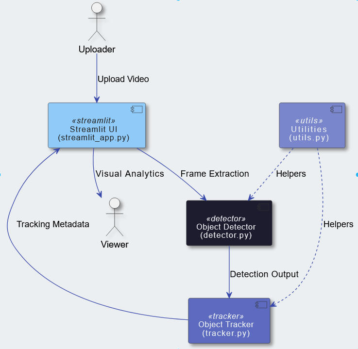

# 🚦 Automated Crowd Counter

_A computer-vision crowd analytics project for detecting, tracking, counting, and analyzing people in video streams using YOLO, modern multi-object tracking, directional line crossing, and exportable analytics._

[](https://www.python.org/)
[](https://streamlit.io/)
[](https://github.com/ultralytics/ultralytics)
[](https://docs.pytest.org/)
[](https://docs.astral.sh/ruff/)
[](LICENSE)

---

## 📚 Table of Contents

- [Overview](#-overview)
- [What Changed In This Version](#-what-changed-in-this-version)
- [Features](#-features)
- [Architecture & Design](#-architecture--design)
- [Getting Started](#-getting-started)
- [Installation & Setup](#-installation--setup)
- [Usage](#-usage)
- [Configuration](#-configuration)
- [Outputs & Reports](#-outputs--reports)
- [Benchmarking](#-benchmarking)
- [Testing](#-testing)
- [Docker](#-docker)
- [How It Works](#-how-it-works)
- [Project Structure](#-project-structure)
- [Counting Accuracy Notes](#-counting-accuracy-notes)

---

## 📌 Overview

**Automated Crowd Counter** is a practical Computer Vision project that detects people in video streams, tracks them across frames, counts directional movement, and produces useful analytics such as current occupancy, total entries, total exits, peak occupancy, trajectories, dwell summaries, and exportable reports.

The project started as a YOLO + CSRT people counter. It has now been upgraded into a more complete crowd analytics pipeline with configurable detector settings, optional modern tracker backends, line-crossing logic, zone occupancy support, Streamlit controls, CLI execution, test coverage, CI, and Docker support.

This makes the repository stronger as a portfolio project because it demonstrates both Computer Vision engineering and real software engineering practices.

---

## ✨ What Changed In This Version

This upgraded version adds major functionality beyond simple detection counting:

- Directional **IN / OUT line-crossing counter**
- Current occupancy and peak occupancy metrics
- Optional tracker backends: **ByteTrack**, **BoT-SORT**, and **CSRT**
- Configurable YOLO model, confidence, IoU, image size, and device
- Polygonal zone occupancy support
- Trajectory collection and export
- Privacy blur mode
- CSV and JSON output reports
- Optional annotated MP4 export
- Improved Streamlit dashboard
- Real CLI runner for reproducible experiments
- Benchmarking script
- Unit tests
- Ruff linting
- GitHub Actions CI
- Docker and Docker Compose support
- Cleaner repository hygiene with virtual environments, caches, and model weights excluded from Git

---

## 🧠 Features

### Computer Vision

- Person detection using Ultralytics YOLO models
- Supports YOLO model variants such as `yolo11n.pt`, `yolo11s.pt`, `yolo11m.pt`, and larger local weights
- Detection confidence and IoU threshold controls
- CPU/GPU device selection through configuration or CLI

### Multi-Object Tracking

- `bytetrack`: modern online tracker through Ultralytics
- `botsort`: stronger tracker option through Ultralytics
- `csrt`: OpenCV baseline tracker for explainable tracking behavior
- Track IDs are used for analytics, not just simple frame-by-frame counting

### Counting & Analytics

- Directional line-crossing events
- Total entered
- Total exited
- Current occupancy
- Peak occupancy
- Crossing timestamps
- Duplicate-crossing debounce
- Zone occupancy
- Per-track trajectories
- Dwell-time-friendly track history
- FPS and processing latency metrics

### Interfaces

- Streamlit app for interactive analysis
- Command-line interface for reproducible runs
- Webcam, uploaded video, and RTSP/URL-style OpenCV sources

### Exports

- Frame-level metrics CSV
- Crossing-events CSV
- Trajectories CSV
- Summary JSON
- Optional annotated MP4 output

### Engineering Quality

- Central YAML configuration
- Typed dataclass-style runtime configuration
- Modular `people_counter` package
- Unit tests for deterministic logic
- Ruff linting
- GitHub Actions CI
- Docker deployment files

---

## 🧭 Architecture & Design

The system is organized as a modular video-processing pipeline:



```text
Input Source
    ↓
Frame Capture
    ↓
YOLO Person Detector
    ↓
Multi-Object Tracker
    ├── ByteTrack
    ├── BoT-SORT
    └── CSRT baseline
    ↓
Analytics Engine
    ├── Directional Line Crossing
    ├── Current / Peak Occupancy
    ├── Zone Occupancy
    ├── Trajectories
    └── Frame Metrics
    ↓
Visualization
    ↓
Streamlit / CLI
    ↓
CSV / JSON / Optional Annotated Video
```

### Core Modules

- **`app.py`**  
  Streamlit interface for selecting input source, model settings, tracker backend, line-crossing settings, runtime options, and downloads.

- **`CLI.py`**  
  Command-line runner for processing videos, webcams, or streams with reproducible arguments.

- **`people_counter/detector.py`**  
  YOLO detector wrapper that filters detections to the person class.

- **`people_counter/tracker.py`**  
  Tracker factory layer that selects the configured tracker backend.

- **`people_counter/trackers/`**  
  Backend implementations for CSRT and Ultralytics tracking.

- **`people_counter/analytics.py`**  
  Line crossing, occupancy, zone counting, trajectories, and summary metrics.

- **`people_counter/counter.py`**  
  Main video-processing pipeline that connects detection, tracking, analytics, visualization, and export.

- **`people_counter/exporters.py`**  
  Writes CSV and JSON outputs.

- **`people_counter/visualization.py`**  
  Draws boxes, IDs, line-crossing overlays, zones, trajectories, FPS, and optional privacy blur.

---

## 🚀 Getting Started

### Requirements

- Python 3.10 or newer
- A webcam, video file, or RTSP/URL stream
- Optional NVIDIA GPU with CUDA-compatible PyTorch for faster inference

> YOLO model weights are **not committed** to the repository. Ultralytics downloads standard model files automatically the first time they are used.

---

## 🛠️ Installation & Setup

### 1. Clone The Repository

```bash
git clone https://github.com/Youssef-Azzam/Crowd_Counter.git
cd Crowd_Counter
```

### 2. Create And Activate A Virtual Environment

Windows:

```bat
python -m venv .venv
.venv\Scripts\activate
```

Linux / macOS:

```bash
python -m venv .venv
source .venv/bin/activate
```

### 3. Install Dependencies

```bash
python -m pip install --upgrade pip
pip install -r requirements.txt
```

### Windows One-Command Setup

You can also run:

```bat
setup_env.bat
```

---

## 🎯 Usage

The project can be used in two ways:

1. Streamlit app for interactive use
2. CLI for reproducible experiments and exports

### Streamlit App

```bash
streamlit run app.py
```

On Windows, after setup:

```bat
run.bat
```

The app supports:

- Uploaded video files
- Webcam input
- RTSP / URL input supported by OpenCV
- YOLO model selection
- Confidence and IoU controls
- Tracker selection: `bytetrack`, `botsort`, or `csrt`
- Line-crossing configuration
- Frame skipping
- Privacy blur
- Annotated MP4 export
- Downloadable CSV/JSON outputs

### CLI

> Important: this repository uses **`CLI.py`** with capital letters.

Process a video:

```bash
python CLI.py --source path/to/video.mp4 --tracker bytetrack --model yolo11n.pt
```

Use webcam:

```bash
python CLI.py --source 0 --tracker bytetrack
```

Save outputs into a specific folder:

```bash
python CLI.py --source path/to/video.mp4 --output-dir outputs/demo
```

Save an annotated MP4:

```bash
python CLI.py --source path/to/video.mp4 --save-video --output-dir outputs/demo
```

Use BoT-SORT:

```bash
python CLI.py --source path/to/video.mp4 --tracker botsort
```

Use a custom counting line:

```bash
python CLI.py --source path/to/video.mp4 --line main:100,300,900,300:negative_to_positive
```

Privacy blur mode:

```bash
python CLI.py --source path/to/video.mp4 --privacy-blur --save-video
```

---

## ⚙️ Configuration

The default configuration is stored in:

```text
config/default.yaml
```

Main configuration sections:

| Section | Purpose |
| --- | --- |
| `detector` | YOLO model path, confidence, IoU, image size, device, and class filtering |
| `tracker` | Tracker backend, IoU association, max misses, and tracker-specific options |
| `analytics` | Counting lines, zones, trajectory length, and overcrowding threshold |
| `output` | CSV, JSON, and annotated video export settings |
| `runtime` | Frame skipping, max frames, display width, privacy blur, trajectories, and FPS overlay |

Example tracker setting:

```yaml
tracker:
  backend: bytetrack
```

Available tracker values:

- `bytetrack`
- `botsort`
- `csrt`

---

## 📦 Outputs & Reports

When export is enabled, the system can produce:

| File | Description |
| --- | --- |
| `frame_metrics.csv` | Per-frame timestamp, active tracks, occupancy, FPS, and latency |
| `crossing_events.csv` | IN/OUT crossing events with track ID and timestamp |
| `trajectories.csv` | Track centroid and bounding-box history |
| `summary.json` | Session-level totals and analytics summary |
| `annotated_output.mp4` | Optional processed video with overlays |

These outputs make the project useful for experiments, demos, dashboards, and later analysis.

---

## 📊 Benchmarking

A benchmark script is included for comparing model and tracker combinations:

```bash
python tools/benchmark.py --source path/to/video.mp4 --models yolo11n.pt yolo11s.pt --trackers bytetrack botsort --max-frames 300
```

Benchmarking is useful for measuring:

- FPS
- Inference/runtime latency
- Tracker choice impact
- Model-size tradeoffs
- Performance on CPU vs GPU

The benchmark writes results to:

```text
outputs/benchmark.csv
```

---

## ✅ Testing

Install development dependencies:

```bash
pip install -r requirements-dev.txt
```

Run linting:

```bash
ruff check .
```

Run tests:

```bash
pytest
```

The tests focus on deterministic project logic such as geometry, configuration loading, line crossing, and analytics counters. They do not require downloading YOLO weights.

---

## 🐳 Docker

Build and run with Docker Compose:

```bash
docker compose up --build
```

Then open:

```text
http://localhost:8501
```

---

## 🎥 Demo

After launching the Streamlit app, choose one of the available input modes:

- Upload a video file
- Use webcam source `0`
- Paste an RTSP / video stream URL

Example interface assets are included in:

```text
docs/screenshots/
```

> If you change the UI later, update these screenshots so the README always matches the real app.

---

## 💡 How It Works

1. **Frame Capture**  
   Frames are read from a video file, webcam, or stream source.

2. **Person Detection**  
   YOLO detects people in each frame and filters to class `0`, the person class.

3. **Tracking**  
   The selected tracker associates detections across frames and maintains track IDs.

4. **Line Crossing**  
   Each track centroid is checked against configurable virtual lines. When a centroid moves from one side of a line to the other, the system records an IN or OUT event.

5. **Occupancy Analytics**  
   The system updates current occupancy, total entered, total exited, peak occupancy, zone counts, trajectories, FPS, and latency.

6. **Visualization**  
   Annotated frames show boxes, IDs, lines, trajectories, FPS, and privacy blur when enabled.

7. **Export**  
   Results are saved as CSV, JSON, and optionally annotated video.

---

## 📁 Project Structure

```text
Crowd_Counter/
├── .github/
│   ├── ISSUE_TEMPLATE/
│   ├── pull_request_template.md
│   └── workflows/
│       └── ci.yml
├── config/
│   └── default.yaml
├── docs/
│   ├── architecture.md
│   ├── architecture.png
│   ├── github_upload.md
│   └── screenshots/
├── people_counter/
│   ├── analytics.py
│   ├── config_runtime.py
│   ├── counter.py
│   ├── detector.py
│   ├── exporters.py
│   ├── geometry.py
│   ├── schema.py
│   ├── tracker.py
│   ├── trackers/
│   │   ├── base.py
│   │   ├── csrt.py
│   │   └── ultralytics_tracker.py
│   ├── utils.py
│   └── visualization.py
├── tests/
│   ├── test_analytics.py
│   ├── test_config.py
│   └── test_geometry.py
├── tools/
│   └── benchmark.py
├── app.py
├── CLI.py
├── Dockerfile
├── docker-compose.yml
├── requirements.txt
├── requirements-dev.txt
├── pyproject.toml
├── ruff.toml
├── setup_env.bat
├── run.bat
└── README.md
```

---

## ⚠️ Counting Accuracy Notes

This project does **not** rely only on counting newly created tracker IDs. That simple method can overcount when:

- people overlap
- people leave and re-enter
- detections disappear for a few frames
- tracks are lost in low FPS video
- people cross each other
- lighting or camera motion reduces detection quality

Directional line crossing is a more meaningful method for entrance/exit counting because it counts events, not just track creation.

For extremely dense crowds where people are heavily occluded, detection-based tracking can still fail. In that case, a true crowd-density estimation model may be more appropriate than person-by-person tracking.

---

## 📌 Repository Hygiene

The repository is designed to avoid committing generated or heavy files:

- Virtual environments are ignored
- `__pycache__` files are ignored
- YOLO `.pt` model weights are ignored
- Runtime output folders are ignored
- Tests and CI are included for reproducibility

If a model file such as `yolo11n.pt` appears locally, that is normal after running YOLO. It should stay on your computer and should not be pushed to GitHub.

---

## 📄 License

This project is released under the MIT License. See [LICENSE](LICENSE).
